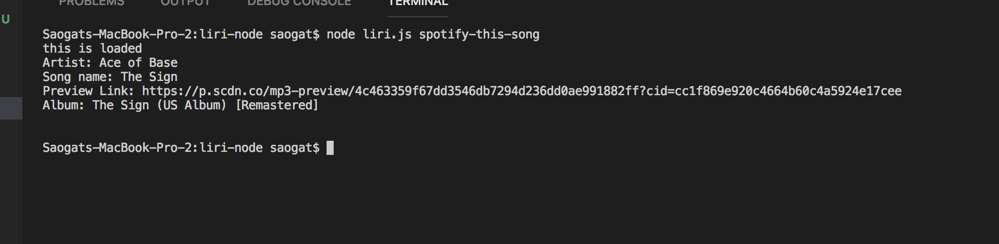

# liri-node

 liri.js can take in one of the following commands:

    * `my-tweets`

    * `spotify-this-song`

    * `movie-this`

    * `do-what-it-says`

* 'my-tweets'
returns latest 20 tweets.

 * `spotify-this-song` 'song to query (default is "The Sign by Ace of Base")
 returns 
     *  Artist(s)
     
     * The song's name
     
     * A preview link of the song from Spotify
     
     * The album that the song is from

* `movie-this` 'moview to query (default is "Mr Nobody")
returns:
       * Title of the movie.
       * Year the movie came out.
       * IMDB Rating of the movie.
       * Rotten Tomatoes Rating of the movie.
       * Country where the movie was produced.
       * Language of the movie.
       * Plot of the movie.
       * Actors in the movie.

 * `do-what-it-says`
 reads random.txt and selects one of the choices above (default is - spotify-this-song,"I Want it That Way")

 
 
 
 